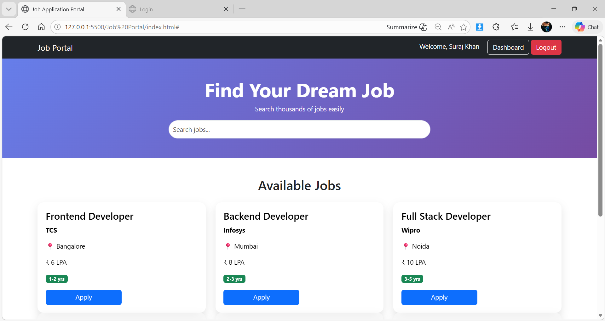
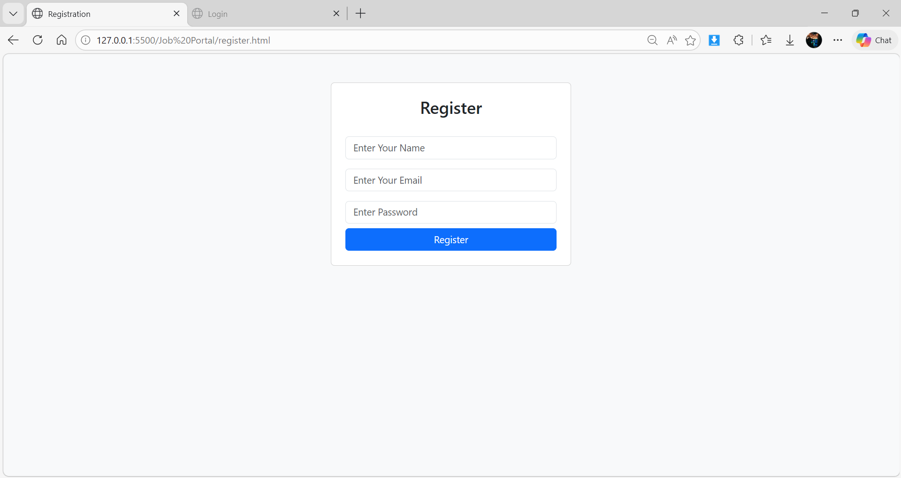
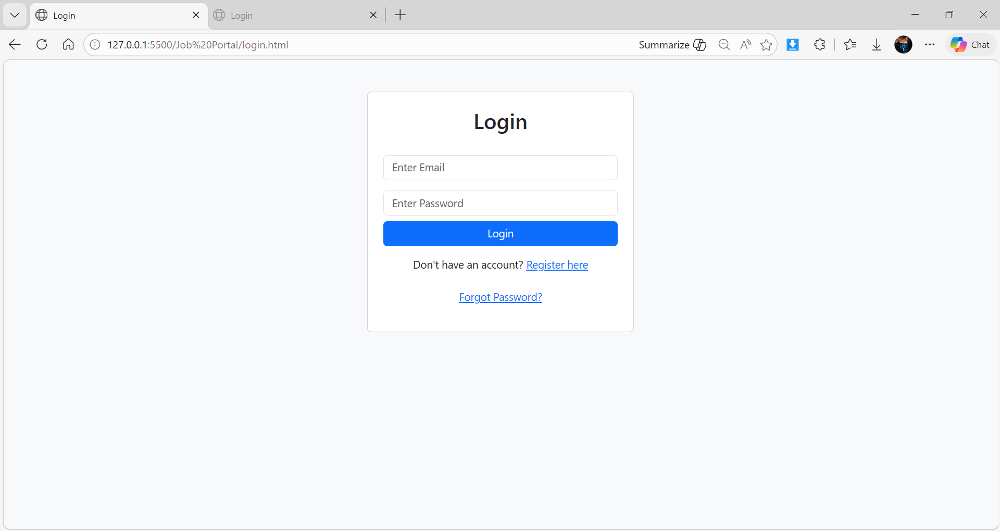
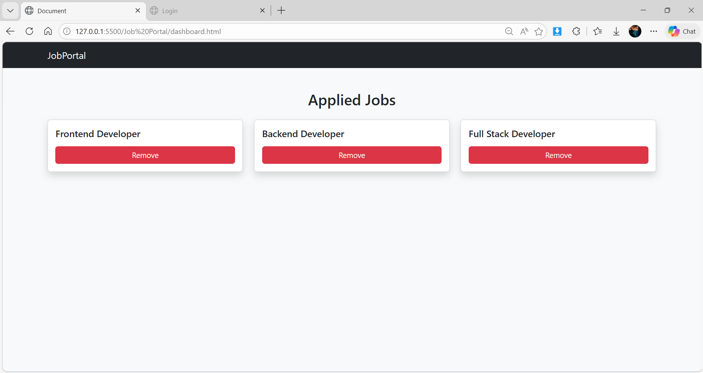

# 💼 Job Portal Web Application

## 🚀 Live Demo

👉 https://job-web-portal.netlify.app/

---

## 📌 Project Overview

A fully functional Job Portal built using HTML, CSS, and JavaScript.
Users can register, login, search jobs, apply, and track applications.

---

## ✨ Features

* 🔐 User Authentication (Register/Login)
* 🔍 Job Search Functionality
* 📄 Apply for Jobs
* 📊 Dashboard to View Applied Jobs
* 💾 Data stored using LocalStorage
* 🎨 Modern UI with Bootstrap & Custom CSS

---

## 🛠️ Technologies Used

* HTML5
* CSS3
* JavaScript
* Bootstrap

---

## 📷 Screenshots

### 🏠 Home Page

### 🔐 Registration Page

### 🔐 Login Page

### 📊 Dashboard

---

## 🧠 What I Learned

* DOM Manipulation
* LocalStorage handling
* UI/UX design basics
* Building complete frontend projects

---

## 📬 Contact

Developed by Suraj 🚀
